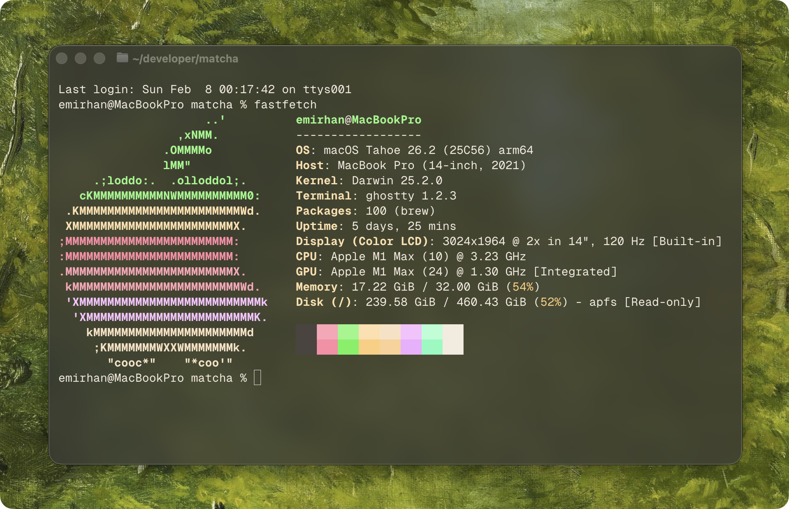

# Matcha

🍵 Carefully brewed theme for Ghostty

<br>



## Usage

1. Copy the theme file to your Ghostty themes directory:

```sh
mkdir -p ~/.config/ghostty/themes
cp themes/matcha ~/.config/ghostty/themes/
```

2. Set `theme = matcha` in your [Ghostty config file](https://ghostty.org/docs/config#file-location)

### Recommended settings

```
window-colorspace = display-p3
window-padding-x = 12
window-padding-y = 12

background-opacity = 0.75
background-blur-radius = 40
```
